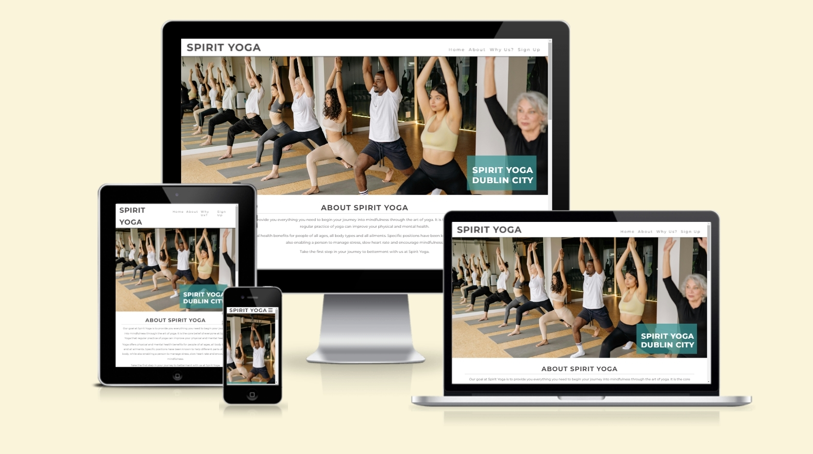
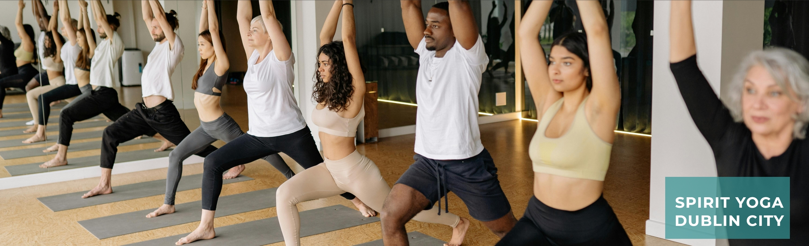
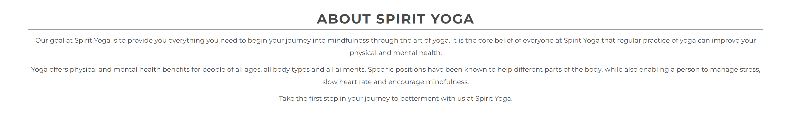
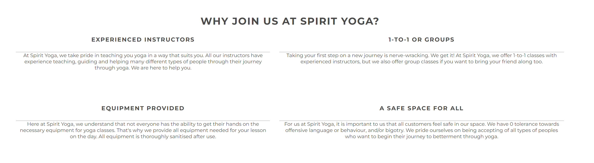
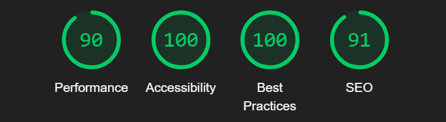

# Spirit Yoga

Spirit Yoga is a website that aims to allow user to sign up to join yoga classes in Dublin city. The site is intended for users who wish to begin their journey of betterment by way of yoga. 

Spirit Yoga includes the goals of the company as well as listing multiple benefits as to why the user should join Spirit Yoga specifcally. Users who wish to attend a yoga class can use the sign-up form.

The live link can be found here - [Spirit Yoga](https://kayla-exe.github.io/spirit-yoga/)

## Site Owner Goals 
- To provide the user with information about the goals of Spirit Yoga.
- To provide the user with clear benefits as to why they should join.
- To present the user with a website that is easy to navigate, fully responsive and invokes a sense of ease in joining the yoga class.
- To enable the user to sign-up to Spirit Yoga with ease.

## User Stories
- ### First time user
  - As a first time user I want to understand the main purpose of the site and learn about the benefits of yoga.
  - As a first time user I want to be able to easily navigate the website and have a positive emotional experience. 
  - As a first time user I want to be able to sign-up to yoga classes without needing to insert payment details.

- ### Returning User
  - As a returning user I want to be able to easily access all of Spirit Yoga's social networks.

## Design

### Imagery
The imagery used on the Spirit Yoga site is very important to the overall experience of the user. A yoga class and group exercise imagery are used consistently throughout. This gives the sense of friendliness if the user was to join the class and is intended to invoke a sense of acceptance in the user.

### Colours
The colour scheme of the website is white and blue. A dark grey font is used which has a good contrast with the light blue and white backgrounds making it easy to read. 

### Fonts
I chose to use the font Montserrat for the entire site. This font was imported via [Google Fonts](https://fonts.google.com/). Sans serif was selected as a back-up font, in case for any reason the main font isn't being imported into the site correctly.

## Features
- ### Navigation

    - The fully responsive navigation bar includes links to the Logo, Home, About, Why Us?, and Sign Up sections of the same page.
    - The navigation bar becomes a drop-down navigation bar on mobile screens.
    - The navigation bar has a fixed position so that it remains visible at the top of the page as the user navigates through the individual sections. 
    - A drop shadow was applied to the navigation bar to make it more prominent against the hero image.
    - This section allows the user to easily navigate through the site to find content without having to scroll back up to the top of the page.

- ### The Landing Page
    - The landing page includes an eye-catching hero image with a text overlay which includes the site's name and location of the yoga classes.
    - This section provides the user with a clear understanding of what the site is designed for.

 

- ### About Section
    - The About Section gives a brief description of the goals of Spirit Yoga as well as some benefits about the consistent practice of yoga.
    - This section aims to grab the attention of the user, and explain clearly what the aim of the site is.

- ### Why Us Section
    - This section contains four blocks of text, each explaining one reason why the user should join Spirit Yoga.
    - This section is valuable as the user is provided clear benefits as to why they should sign-up to the site.

- ### Sign-up Section
    - The Sign-Up section includes a background image of three women in exercising clothing enjoying their time at a yoga class.
    - The user is invited to sign up to Spirit Yoga classes, by inputing their personal details.

 

- ### Footer
    - The footer section includes links to Mind Yoga's Facebook, Instagram, Twitter and Youtube pages.
    - The links will open to a new tab to allow easy navigation for the user, and to also keep the Spirit Yoga site open in a tab.
    - The footer is valuable as it allows the user to find all of Spirit Yoga's social networks in one place.

## Testing

### Validator Testing
- #### HTML
    - No errors or warnings when put through the official HTML Validator
        [W3C Validator Results](https://validator.w3.org/nu/?showsource=yes&doc=https%3A%2F%2Fkayla-exe.github.io%2Fspirit-yoga%2F)
- #### CSS
    - No errors or warnings when put through the official CSS Validator
        [W3C Validator Results](https://jigsaw.w3.org/css-validator/validator?uri=https%3A%2F%2Fvalidator.w3.org%2Fnu%2F%3Fshowsource%3Dyes%26doc%3Dhttps%253A%252F%252Fkayla-exe.github.io%252Fspirit-yoga%252F&profile=css3svg&usermedium=all&warning=1&vextwarning=&lang=en)
- #### Accessibility 
    - The site achieved a Lighthouse accessibility score of 100% confirming my effective choice of easy to read colours and designs.
    - 

### Form Testing
- The form has been tested to ensure it would not submit without the necessary input fields being filled in (first name, surname, email, and class type).

### Links Testing
- All navigation links were tested manually to ensure the user is directed to the correct section of the website.
- Social network links in the footer were tested manually to ensure they open in a new tab.

### Browser Testing
- The Website was tested on Google Chrome, Firefox, and Microsoft Edge browsers with no issues noted.
    
### Device Testing
- The website was viewed on a variety of devices such as Desktop, Laptop, Galaxy Fold 5, iPhone SE and iPad Air to ensure responsiveness on various screen sizes. The website performed as intended. The responsive design was also checked using Chrome developer tools across multiple devices with the site adapting seamlessly as intended with each different device size.
- I also used the following websites to test responsiveness:
    - [Responsinator](http://www.responsinator.com/?url=https%3A%2F%2Fkayla-exe.github.io%2Fspirit-yoga%2F)
    - [Am I Responsive](https://ui.dev/amiresponsive?url=https://kayla-exe.github.io/spirit-yoga/)

### Friends and Family User Testing
I asked numerous tech-savvy friends and family to use the site and to report any bugs they encountered.

### Fixed Bugs
#### Page Areas being covered by Navigation Bar when jumped to
- The navigation bar has anchor links that allow the user to jump to the different areas of the site.
- While testing as I coded, I realised that the navigation bar being stuck to the top of the screen was causing issues with the headers of each section being covered when jumped to with the anchor links in the navigation bar.
- I fixed this by putting the anchor id div at the very end of the section above where I actually wanted the user to jump too. This made it show that the full desired section, including header was in complete view.

#### Unfortunate zooming on Sign-up section
- When I first implemented my sign-up styling, I did it with the idea of 'mobile-first.' 
- When I inspected the section through the view of a laptop or larger, the background image would zoom in on the three women's chest and cut off their faces, which wasn't ideal.
- To resolve this, I added a rule within the 'laptop or larger' media query to give the background image a specific height of 600px, as to allow the full image to be shown.

## Technologies Used

### Languages
- HTML5
- CSS

### Programs Used
- [GitHub](https://github.com/)
- [Chrome Dev Tools](https://developer.chrome.com/docs/devtools/)
- [W3C](https://www.w3.org/)
- [Google Fonts](https://fonts.google.com/)
- [Font Awesome](https://fontawesome.com/)
- [Am I Responsive](https://ui.dev/amiresponsive)
- [TinyPNG](https://tinypng.com/)
- [Responsinator](http://www.responsinator.com/)

## Deployment

The project was deployed using GitHub pages. The steps to deploy using GitHub pages are:

1. Go to the repository on GitHub.com
2. Select 'Settings' at the top of the page.
3. Select 'Pages' from the menu bar on the left of the page.
4. Under 'Source' select the 'Branch' dropdown menu and select the main branch.
5. Once selected, click the 'Save'.
6. Deployment should be confirmed by a message on a green background saying "Your site is published at" followed by the web address.

## Credits

### Content
All benefits of yoga were found from the below sites:
- [Yogaru](https://www.yogaru.ie/pause/the-benefits-of-yoga)
- [Johns Hopkins Medicine](https://www.hopkinsmedicine.org/health/wellness-and-prevention/9-benefits-of-yoga)

### Media
All images and videos were sourced from the one site, listed below:
- [Pexels](https://www.pexels.com/)

### Resources Used

- My learning from the Code Institute taugh 'Love Running' project [Love Running](https://kayla-exe.github.io/love-running/)
- Revision of how anchor tags work [Typepad](https://help.typepad.com/anchor-tags.html)

## Acknowledgments
My mentor Antonio for his support and advice.
My class cohort Laura for her guidance, understanding and assistance.
The CI student care team, for giving me the support I needed.
